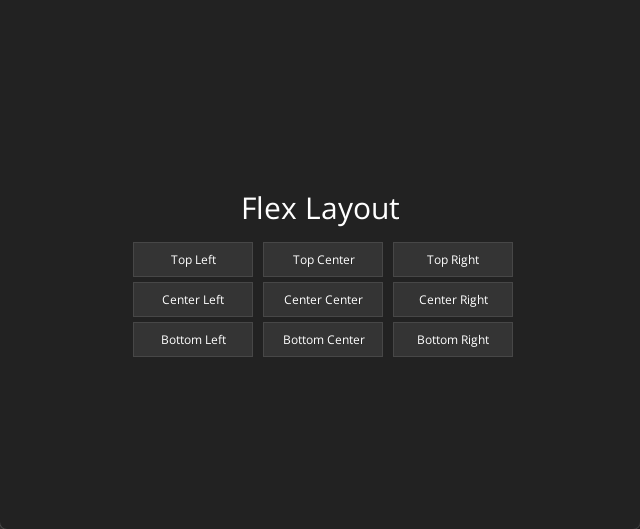

# Layout example

Advanced example showing how different layout types can be composed to build complex layouts.

This example uses the following built-in components:
- Grid container
- Button
- Text